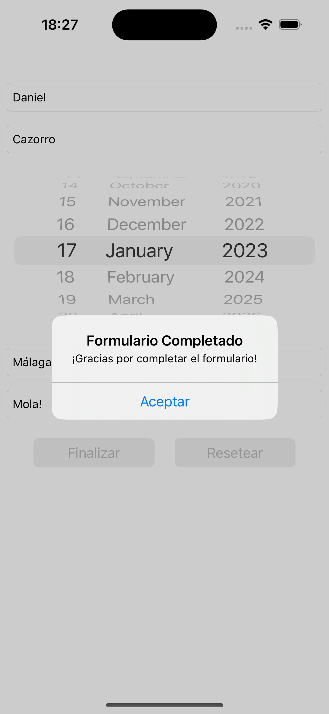
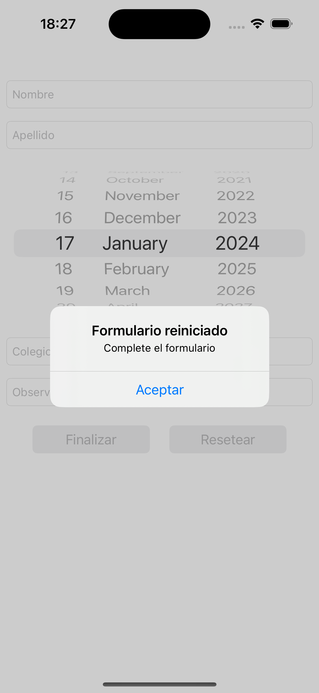
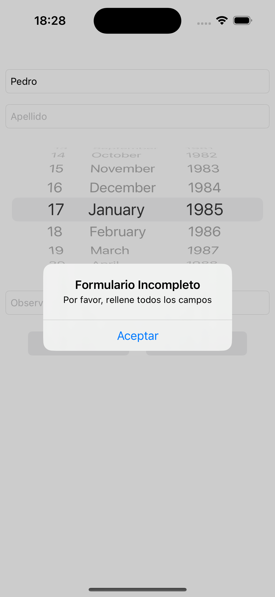

# AgeCheckInApp

Esta aplicación proporciona un formulario de registro que incluye información sobre el nombre, apellido, fecha de nacimiento, escuela y observaciones. La visibilidad del campo de la escuela se actualiza dinámicamente según la edad proporcionada.

## Características

- **Formulario dinámico:** La visibilidad del campo de la escuela se actualiza automáticamente según la fecha de nacimiento proporcionada.

- **Validación del formulario:** Se asegura de que los campos obligatorios estén completos y que la fecha de nacimiento sea válida.

- **Interfaz fácil de usar:** Se proporciona una interfaz simple para completar el formulario.

## Capturas de Pantalla

## Instrucciones de Uso

1. **Nombre y Apellido:** Completa los campos del nombre y apellido.

2. **Fecha de Nacimiento:** Selecciona tu fecha de nacimiento usando el selector de fecha.

3. **Escuela (si eres menor de edad):** Completa el campo de la escuela si eres menor de edad.

4. **Observaciones:** Agrega observaciones adicionales si lo deseas.

5. **Finalizar:** Presiona el botón "Finalizar" una vez que hayas completado el formulario.

6. **Reiniciar:** Presiona el botón "Reiniciar" para restablecer el formulario.

## Requisitos del Proyecto

- **Xcode:** Asegúrate de tener Xcode instalado en tu máquina.
